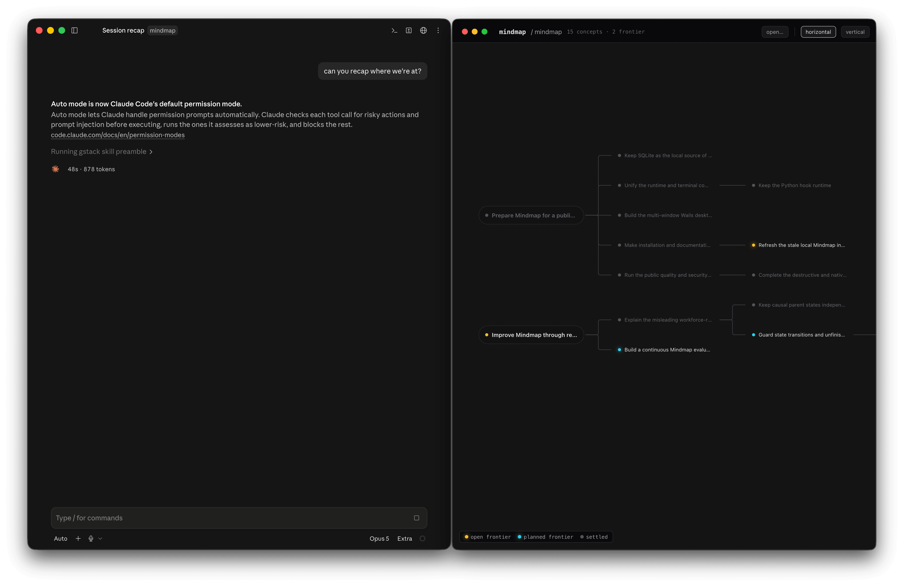
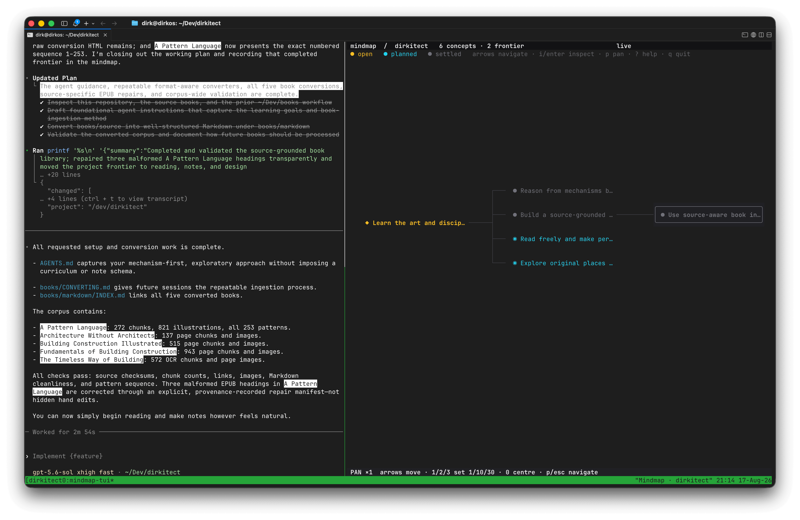

# Mindmap

Mindmap keeps a small causal map of the work in each coding project. It turns long Codex and Claude Code sessions into goals, decisions, open questions, and explicit next steps without becoming another task manager.

Mindmap stores its own data on your machine and opens no network listener or remote service of its own. Your coding agent still interprets prompts and transcripts under its own privacy and usage terms.





Each node is a meaningful concept, not a message or activity-log entry:

- `planned` - explicitly intended, but not started
- `open` - active work, an unresolved question, or a thread worth resuming
- `settled` - completed work or a resolved decision

Parent links mean “grew out of.” Open and planned leaves form the frontier; settled branches show what the project has covered.

## Install

### macOS desktop

Download `mindmap_macos_universal.dmg` from the [latest release](https://github.com/erd0s/mindmap/releases/latest), open it, and drag **Mindmap** to Applications. The app is a signed, notarized universal build for macOS 12 or later.

The desktop app views and edits maps; the agent plugin records them. To install the plugin and terminal viewer too, run:

```sh
curl -fsSL https://raw.githubusercontent.com/erd0s/mindmap/main/install.sh | sh
```

### Terminal viewer

The same installer supports macOS and Linux:

```sh
curl -fsSL https://raw.githubusercontent.com/erd0s/mindmap/main/install.sh | sh
```

Windows currently supports the terminal viewer only:

```powershell
irm https://raw.githubusercontent.com/erd0s/mindmap/main/install.ps1 | iex
```

FreeBSD, OpenBSD, and additional architectures can download a matching `mindmap_<os>_<arch>` asset from [GitHub Releases](https://github.com/erd0s/mindmap/releases).

The Codex and Claude integrations require Python 3.10 or later. During setup, Mindmap saves the absolute interpreter path for its bundled Python launchers, so a Finder-launched agent does not have to inherit the setup shell's `PATH`. The terminal viewer and desktop app do not require Python.

## Start a map

Open a local coding-agent session inside a project, then invoke Mindmap:

| Action | Codex | Claude Code |
|---|---|---|
| Start and reconstruct this session | `$mindmap:manage start` | `/mindmap:manage start` |
| Reconcile the map with recent work | `$mindmap:manage sync` | `/mindmap:manage sync` |
| Show the current map | `$mindmap:manage status` | `/mindmap:manage status` |
| Record the final state and stop tracking | `$mindmap:manage stop` | `/mindmap:manage stop` |

Codex also accepts `$mindmap start`, `$mindmap sync`, `$mindmap status`, and `$mindmap stop`.

Run `mindmap` in the project for the terminal view, or open Mindmap on macOS and choose a coding session from its custom picker. Use <kbd>⌘</kbd><kbd>O</kbd> or <kbd>⌘</kbd><kbd>N</kbd> to open another session; press <kbd>Esc</kbd> to close the picker. Every selection opens in its own window. Both views update after the agent commits a graph change.

Mindmap remains active for the whole project directory until you stop it. New local Codex or Claude sessions beneath that directory receive the current map automatically.

## Install an agent later

The installer never assumes which agent you use. If you install one later, repair its integration at any time:

```sh
mindmap setup codex
mindmap setup claude
mindmap setup --all
mindmap setup --refresh --all
mindmap integrations
mindmap doctor
```

Setup adds the public `erd0s/mindmap` marketplace and installs `mindmap@erd0s-mindmap`. It is idempotent: rerunning it repairs old marketplace IDs and upgrades an outdated plugin. Add `--refresh` to force a marketplace refresh and reinstall.

For Claude Desktop, run `mindmap setup claude` first; afterward, use the Code tab's plugin manager to enable or manage Mindmap. For Codex Desktop, run `mindmap setup codex`, then begin a new local session. If a desktop-only installation does not put `claude` or `codex` on your shell `PATH`, install that host's CLI command or follow its marketplace instructions, then rerun setup. Review and trust the lifecycle hooks when either host asks.

Local desktop coding sessions behave like their CLI counterparts: the same skills and hooks write the same local SQLite database. General ChatGPT or Claude chats are not coding-agent sessions, and remote/cloud sessions cannot share a machine-local database. See [the compatibility contract](docs/compatibility.md) for the precise boundary.

## Terminal controls

Run `mindmap` with no command to open the live terminal view. Press <kbd>?</kbd> for the complete in-app reference.

| Key | Action |
|---|---|
| Arrow keys | Move through parents, children, and visual neighbours |
| <kbd>Enter</kbd> or <kbd>i</kbd> | Open the selected concept |
| <kbd>d</kbd> or <kbd>Delete</kbd> | Confirm and delete the selected branch |
| <kbd>p</kbd> | Toggle pan mode |
| <kbd>1</kbd>, <kbd>2</kbd>, <kbd>3</kbd> | Set the pan step to 1, 10, or 30 characters |
| <kbd>0</kbd> | Centre the selected concept |
| <kbd>?</kbd> | Show keyboard help |
| <kbd>q</kbd> or <kbd>Ctrl-C</kbd> | Quit |

Mindmap detects limited terminals and `NO_COLOR`. Override detection per run with `--color none` or `--ascii always`, or save it:

```sh
mindmap config --color none --ascii always
```

## Command line

`mindmap --help` lists the complete interface. Useful commands include:

```sh
mindmap                         # terminal viewer for the current project
mindmap --root ~/Dev/example    # view a project from elsewhere
mindmap projects                # list local maps
mindmap status                  # show a compact summary
mindmap snapshot                # export the current map as JSON
mindmap open                    # open the current project on macOS
mindmap delete CONCEPT_ID       # confirm, then delete a branch
mindmap stop                    # stop automatic tracking; retain the map
```

Deleting a node also deletes every descendant from the current map. The desktop app and terminal viewer both ask for confirmation. Mindmap remembers those user-deleted ids so retained transcript evidence cannot recreate the branch unless the user explicitly asks to restore it. Provenance events and imported transcript evidence remain in SQLite, so deletion is not secure erasure.

## Local data and privacy

SQLite is the source of truth because Mindmap needs atomic checkpoints, safe concurrent agent writes, transcript cursors, retry idempotency, and revision checks. A directory of loose files cannot provide those guarantees without rebuilding a database protocol.

The database defaults to:

```text
${XDG_DATA_HOME:-~/.local/share}/mindmap/mindmap.sqlite3
```

Mindmap reads only transcripts named by installed local agent hooks. It stores normalized user and assistant text as private reconstruction evidence, but neither viewer exposes a transcript reader. It sends no data to a Mindmap service because there is no Mindmap service.

Treat the database as sensitive. Back it up only when no writers are active, or use SQLite's backup tools. Do not place the live database or its WAL files in a file-sync folder.

## Build and contribute

Requirements for a full checkout build are Python 3.10+, Go 1.25.13+, and Node.js 24+.

```sh
npm ci --prefix desktop/frontend
make validate
```

`make mindmap` builds the current terminal binary. `./scripts/build_tui.sh linux/amd64 darwin/arm64 windows/amd64` cross-compiles selected terminal targets. A universal desktop build must run on macOS:

```sh
./scripts/build_macos_app.sh
```

The desktop layer pins Wails v3 beta 8 because native multi-window support is a v3 feature. The release workflow builds, signs, notarizes, and staples the macOS app before publishing it.

Read [CONTRIBUTING.md](CONTRIBUTING.md), [the architecture notes](docs/architecture.md), and [the functional test runbook](docs/functional-test.md) before changing the storage or hook contract. Maintainers can follow [the release guide](docs/releasing.md). Security reports belong in [SECURITY.md](SECURITY.md).

Mindmap is available under the [MIT License](LICENSE).
